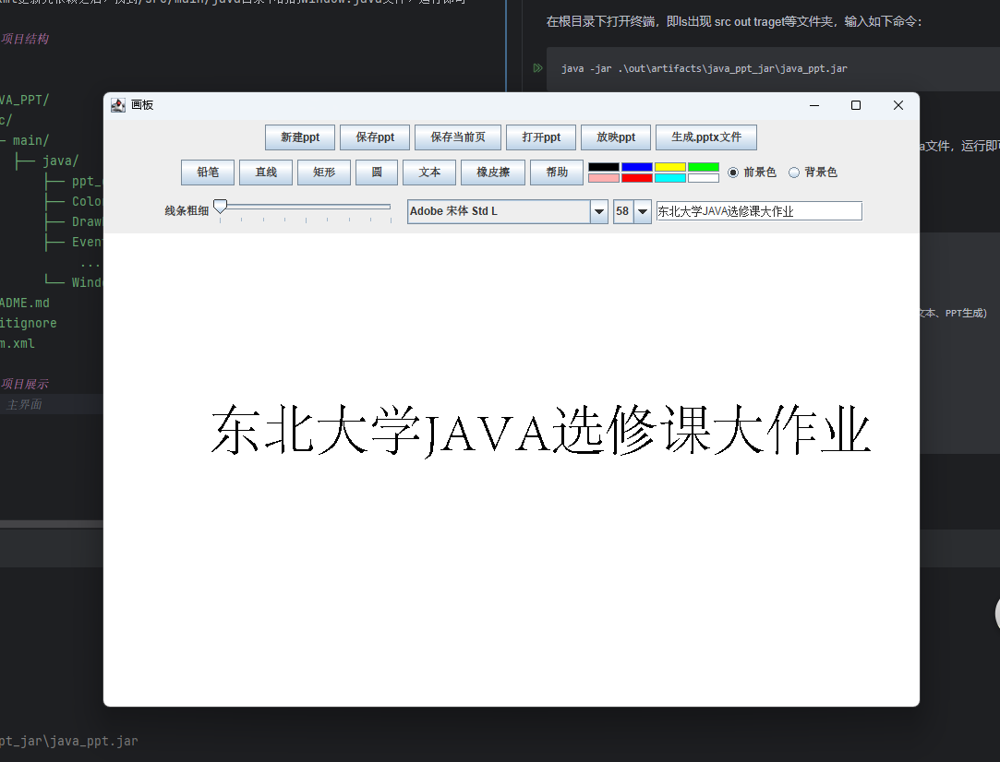

# NEU_JAVA_PPT
东北大学java选修课大作业——使用Java制作ppt  
这个项目是一个简单的 PowerPoint 幻灯片生成器，使用 Java 编写。用户可以创建、编辑并保存幻灯片，支持插入各种形状、文本和图片。程序提供了一个交互式界面，用户可以绘制形状、插入文本，并自定义幻灯片内容。   
其中生成.pptx文件部分基于  pptshow实现：https://github.com/qrpcode/pptshow.git
## 一、功能特性

### 1. **新建幻灯片**
- 用户可以点击工具栏中的 **"新建ppt"** 按钮，创建一个新的幻灯片。每次新建都会清空当前幻灯片内容，准备开始编辑新的幻灯片。

### 2. **绘制基本图形**
- 支持绘制多种基本图形，用户可以通过点击工具栏中的 **"铅笔"**、**"直线"**、**"矩形"**、**"圆"** 按钮来选择所需图形类型。用户点击画布并拖动鼠标绘制图形。每种图形支持自由拖动调整，实时绘制效果。

### 3. **插入文本**
- 通过点击 **"文本"** 按钮，用户可以在文本框中输入文本，选择字体、字号、颜色等样式，然后点击画布的任意位置插入文本。文本内容可以随时修改，字体和样式支持动态调整。

### 4. **颜色选择**
- 提供前景色和背景色的选择。用户可以通过点击工具栏中的颜色按钮选择颜色，也可以使用 **"自定义颜色"** 按钮弹出颜色选择器，选择任何颜色并应用到前景或背景。

### 5. **修改文字样式**
- 用户可以修改文本的字体、字号和颜色。通过 **"字体选择器"** 和 **"字号选择器"** 下拉框来选择系统字体和字号，字体样式支持 **加粗**、**斜体** 等效果，文本颜色可以通过颜色选择器来设置。

### 6. **撤销操作**
- 支持撤销和重做功能。用户可以通过快捷键 **Ctrl+Z** 撤销上一步操作，适用于形状绘制、文本插入、颜色选择等内容的变动。

### 7. **保存幻灯片为图片**
- 用户可以将当前幻灯片内容保存为图片。点击 **"保存当前页"** 按钮，选择保存路径和文件类型（支持 **.png** 或 **.jpg** 格式）后，系统将当前幻灯片内容保存为图片文件。

### 8. **保存和打开 PPT 文件**
- 用户可以通过 **"保存ppt"** 按钮保存整个幻灯片文件，通过 **"打开ppt"** 按钮加载已保存的 PowerPoint 文件，可以继续编辑保存的幻灯片。

### 9. **生成 PowerPoint 文件**
- 用户可以将当前幻灯片内容生成一个 .pptx 格式的 PowerPoint 文件。点击 **"生成.pptx文件"** 按钮，程序会将当前幻灯片中的图形、文本、图片等内容转化为 PowerPoint 幻灯片格式并保存。

### 10. **放映 PowerPoint 幻灯片**
- 支持幻灯片的自动播放。用户点击 **"放映ppt"** 按钮后，程序将自动播放当前幻灯片内容，幻灯片内容会每隔一定时间自动切换(默认设置为3s)，用户也可以手动切换幻灯片。

### 11. **全屏播放**
- 在播放幻灯片时，程序支持全屏显示。用户可以通过快捷键或界面操作进入全屏模式，展示效果更加生动。

### 12. **插入图像**
- 支持插入图片到幻灯片中。用户可以通过 **"插入图片"** 按钮选择本地图片文件，将图片插入到幻灯片中的任意位置。

### 13. **基本图形绘制**
- 除了标准的图形（矩形、圆形、线条等），程序还支持自定义形状（如平行四边形和圆角矩形），用户可以选择不同的形状并调整其参数。

### 14. **帮助信息**
- 程序提供详细的使用帮助，用户可以通过点击工具栏中的 **"帮助"** 按钮或快捷键 **Ctrl+H** 查看操作说明。帮助内容包括功能说明、快捷键说明等。

### 15. **背景音乐及自动播放**
- 当前生成的ppt默认加入了本地的background.mp3作为背景音乐，在放映时自动播放，并且默认设置为每页幻灯片播放3s,与当前页面中播放速度保持一致
## 二、技术栈

- **Java**：使用 Java 语言进行开发，提供图形界面和功能实现。
- **Swing**：用于实现图形用户界面（GUI），包括窗口、按钮、文本框等组件。
- **cc.pptshow**：用于生成和操作 PowerPoint 文件，实现幻灯片内容的生成和保存。
- **图形处理**：利用 Java 的图形和绘制功能，用户可以绘制和调整形状、插入文本和图片。

## 三、安装与运行

### 1. 环境要求
开发时使用的环境为Idea默认提供的SDK 11.0.16   
另外，经过测试OracleJDK 23.0.1也可以正常运行

### 2. 克隆项目

```bash
git clone https://github.com/veryjoyran/NEU_JAVA_PPT.git
```
### 3. 运行项目
#### 3.1 更新依赖
- 使用 IntelliJ IDEA 打开项目，等待 Maven 下载依赖。
如果运行时提示缺少依赖，请手动更新pom.xml文件，确保添加如下依赖：
```xml
 <dependencies>
        <dependency>
            <groupId>cc.pptshow</groupId>
            <artifactId>pptshow</artifactId>
            <version>1.3</version>
        </dependency>
</dependencies>
<build>
<plugins>
    <plugin>
        <groupId>org.apache.maven.plugins</groupId>
        <artifactId>maven-shade-plugin</artifactId>
        <version>3.2.1</version>
        <executions>
            <execution>
                <phase>package</phase>
                <goals>
                    <goal>shade</goal>
                </goals>
                <configuration>
                    <transformers>
                        <transformer implementation="org.apache.maven.plugins.shade.resource.ManifestResourceTransformer">                  <mainClass>Window</mainClass>
                        </transformer>
                    </transformers>
                </configuration>
            </execution>
        </executions>
    </plugin>
</plugins>
</build>
```
#### 3.2 通过jar包运行
在根目录下打开终端，即ls出现 src out traget等文件夹，输入如下命令：
```bash
java -jar .\out\artifacts\java_ppt_jar\java_ppt.jar
```

#### 3.3 源码编译运行   
在pom.xml更新完依赖之后，找到/src/main/java目录下的的Window.java文件，运行即可

## 四、项目结构

```
NEU_JAVA_PPT/
├── src/
│   ├── main/
│   │   ├── java/
│           ├── ppt_generate/            # 主要功能实现类（图形、文本、PPT生成）
│           ├── Colorlist.java           # 颜色选择器
│           ├── DrawBoard.java           # 绘图区域
│           ├── EventListener.java       # 事件监听器  
                 ......             
│           └── Window.java              # 程序入口
├── README.md                   # 项目的说明文档
└── .gitignore                  # Git 忽略文件    
└── pom.xml                     # Maven 项目配置文件
```     
## 五、项目展示


## 六、注意事项  
- 在运行之前，确保包含了ppt文件夹，不然由于路径问题会导致无法正常运行（ppt会创建失败）
- 在使用jar包运行时，确保运行的路径为项目根路径
- 在使用源码编译运行时，确保pom.xml文件中的依赖已经更新
- 在使用源码编译运行时，确保jdk版本为11.0.16或者23.0.1及以上
- 生成的ppt使用office可能出现格式不兼容导致无法正常加载的问题，建议使用wps打开